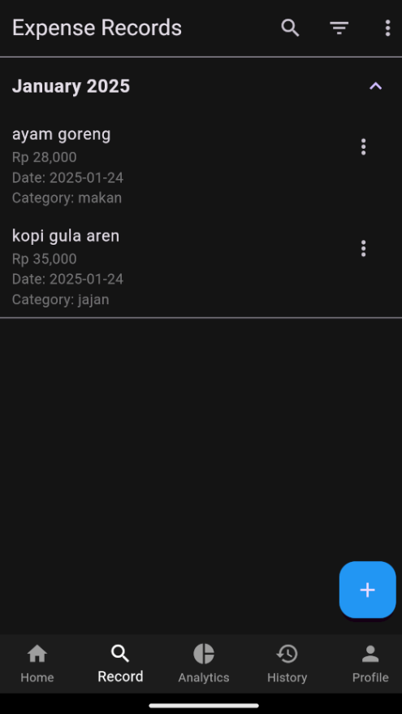
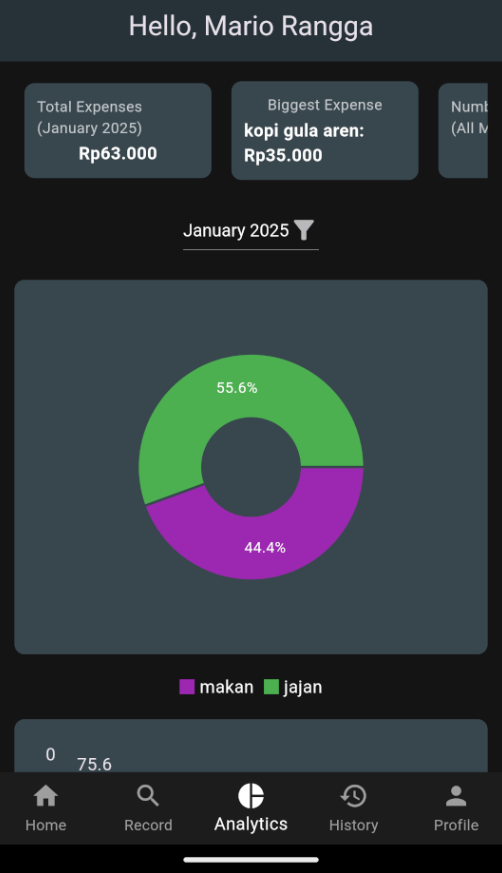

# Expense Tracker

Expense Tracker is a Flutter-based application designed to help users track their monthly expenses, view summaries, and analyze expense distributions by category. This app leverages Flutter's material design principles to provide an intuitive and responsive user interface.

## Features

- **Monthly Expense Summary**: View total expenses, biggest expense, and the number of transactions for a selected month.
- **Category Distribution**: Visualize expenses by category using a pie chart.
- **Historical Trends**: Analyze expense trends over time using bar charts.
- **Expense Filtering**: Filter expenses by month for focused analysis.

## Screenshots

<p align="center">
   
   
   
   
</p>

## Getting Started

### Prerequisites

Ensure you have the following tools installed on your system:
- [Flutter SDK](https://flutter.dev/docs/get-started/install)
- [Dart](https://dart.dev/get-dart)
- An IDE such as [Android Studio](https://developer.android.com/studio) or [Visual Studio Code](https://code.visualstudio.com/).

### Installation

1. Clone this repository:
   ```bash
   git clone https://github.com/komarr007/expense-tracker.git
   ```

2. Navigate to the project directory:
   ```bash
   cd expense-tracker
   ```

3. Install dependencies:
   ```bash
   flutter pub get
   ```

4. Run the app:
   ```bash
   flutter run
   ```

### Core Folder Structure

```
expense-tracker/
└── 📁lib
    └── 📁helpers
        └── db_helper.dart
    └── 📁models
        └── expense.dart
        └── history_record.dart
    └── 📁screens
        └── add_expense_screen.dart
        └── dashboard_screen.dart
        └── expense_list_screen.dart
        └── history_screen.dart
        └── home_screen.dart
        └── splash_screen.dart
    └── 📁services
    └── 📁widgets
    └── main.dart

└── 📁assets
    └── 📁databases
    └── 📁images
        └── icon.png
        └── logo.png

└── 📁test
    └── 📁unit
        └── db_helper_test.dart
        └── db_helper_test.mocks.dart
    └── widget_test.dart
```

### Core Key Files

- **`dashboard_screen.dart`**: Contains the main logic for the dashboard, including summary cards, pie charts, and bar charts.
- **`db_helper.dart`**: Provides database operations for fetching and storing expense data.
- **`expense.dart`**: Defines the `Expense` model used across the app.

### Linting and Code Style

This project uses the `flutter_lints` package for linting. Make sure your code adheres to the project's lint rules by running:
```bash
flutter analyze
```

## Dependencies

This project relies on the following Flutter dependencies:

### Core Dependencies
- **Flutter SDK**: [flutter](https://flutter.dev) (Required to build and run the application)
- **Cupertino Icons**: [cupertino_icons](https://pub.dev/packages/cupertino_icons) `^1.0.8` (iOS-style icons)

### Essential Packages
- **Charting Library**: [fl_chart](https://pub.dev/packages/fl_chart) `^0.69.0` (For creating charts and graphs)
- **SQLite Integration**: [sqflite](https://pub.dev/packages/sqflite) `^2.0.0+4` (For local database storage)
- **Path Provider**: [path_provider](https://pub.dev/packages/path_provider) `^2.0.11` (Access to file paths)
- **Internationalization**: [intl](https://pub.dev/packages/intl) `^0.20.1` (For formatting dates, numbers, and more)

### Utilities
- **Toast Notifications**: [fluttertoast](https://pub.dev/packages/fluttertoast) `^8.2.8` (For showing toast messages)
- **File Picker**: [file_picker](https://pub.dev/packages/file_picker) `^8.1.7` (For file selection)
- **Permission Handling**: [permission_handler](https://pub.dev/packages/permission_handler) `^11.0.0` (For managing runtime permissions)
- **Device Info**: [device_info_plus](https://pub.dev/packages/device_info_plus) `^11.2.0` (For fetching device information)

### Development & Debugging
- **Logging**: [logger](https://pub.dev/packages/logger) `^2.5.0` (For structured logging)
- **Build Runner**: [build_runner](https://pub.dev/packages/build_runner) `^2.4.13` (Code generation utilities)
- **Mocking**: [mockito](https://pub.dev/packages/mockito) `^5.4.4` (For testing and mocking functionality)

### Additional Utilities
- **Path Utilities**: [path](https://pub.dev/packages/path) `^1.9.0` (Path manipulation utilities)


## Contributing

Contributions are welcome! If you have suggestions or improvements, feel free to submit a pull request.

## License

This project is licensed under the MIT License. See the [LICENSE](LICENSE) file for details.

---

Happy tracking!
