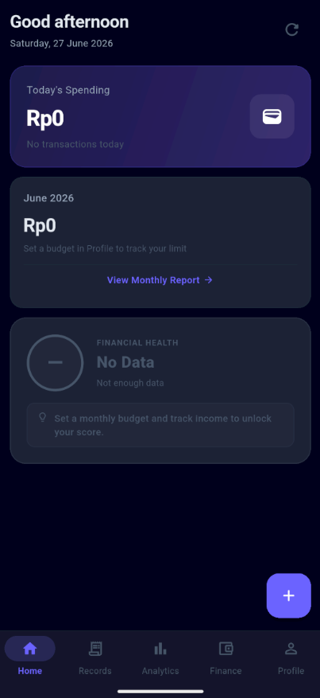
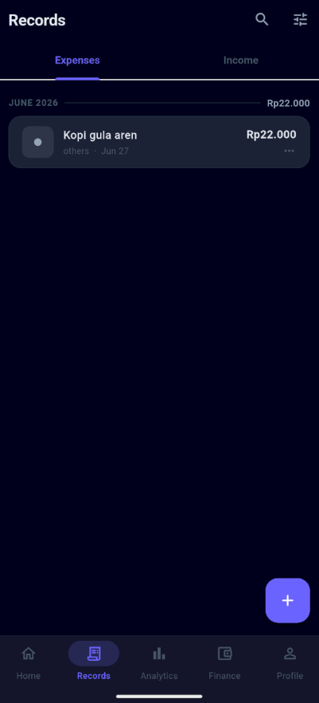
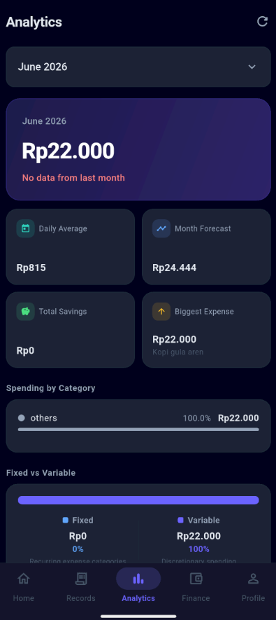
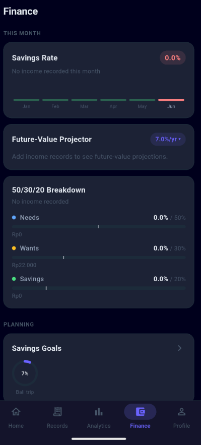
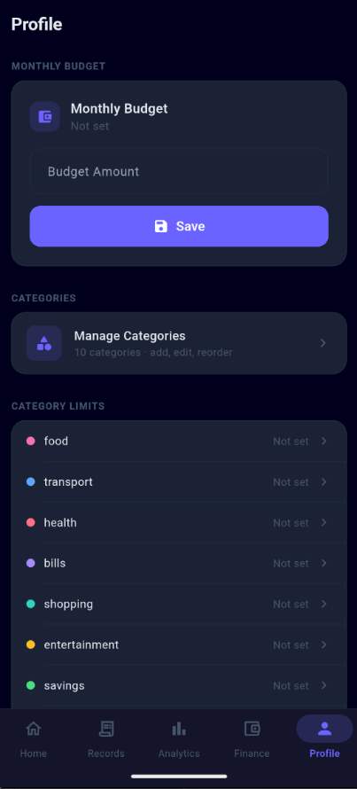

# The Money Logger

A personal finance Android app built with Flutter. Track expenses and income, manage budgets, plan savings goals, monitor debts, and understand your financial health — all stored locally with no cloud dependency.

**Version 1.4.0** · Android · Flutter SDK ^3.5.3 · SQLite

---

## Features

### Expense & Income Tracking
- Add, edit, and soft-delete expenses with name, amount, date, category, and notes
- Record income by category (salary, freelance, business, investment return, bonus, gift)
- Recurring expenses — daily, weekly, or monthly — auto-applied on app open
- Deleted records kept for 14 days with restore from history

### Dynamic Categories
- User-defined expense categories — add, edit, reorder by drag, and delete
- Each category has a custom color and a 50/30/20 bucket assignment (Needs / Wants / Savings)
- Colors propagate live across all charts, dots, and breakdown cards

### Home Dashboard
- Today's spending hero card with transaction count
- Month-over-month comparison with % change pill
- Monthly budget progress bar (set in Profile)
- Monthly cashflow card (income vs expenses)
- Financial Health Score — composite of savings rate, budget control, and spending trend
- Spending insights: cashflow, budget pace, fastest-growing category, weekend vs weekday pattern

### Analytics Tab
- Expense and income list with search, date range filter, and category filter
- Grouped by month with totals per group
- Tap any record to edit inline

### Finance Tab
- **Savings Rate** — 6-month bar chart of monthly savings rate
- **Future-Value Projector** — annuity curve showing 10/20/30-year growth from avg monthly savings; adjustable annual return rate
- **50/30/20 Breakdown** — Needs / Wants / Savings bars vs target benchmarks, based on this month's income
- **Savings Goals** — named goals with ring-progress UI, optional deadline, Add Funds dialog
- **Net Worth** — assets vs liabilities, tap to manage items
- **Envelope Budgets** — per-category monthly budget with spent/remaining progress
- **Debt Tracker** — track multiple debts with payoff optimizer (avalanche / snowball), extra payment, payoff date, and total interest per debt

### Opportunity Cost Nudge
- While typing an expense amount, a live hint shows the 10-year future value at 7%/yr — a gentle reminder of the trade-off

### Profile Tab
- Set a global monthly budget
- Set per-category spending limits (notifications fire when exceeded)
- **Manage Categories** — full CRUD screen for expense categories
- Backup database to a `.db` file and restore from backup
- Export all expenses and income to `.xlsx`
- Recurring expense management

---

## Screenshots

<p align="center">
  
  
  
  
  
</p>

---

## Getting Started

### Prerequisites

- [Flutter SDK](https://flutter.dev/docs/get-started/install) ^3.5.3
- Android Studio or VS Code with the Flutter extension
- Android device or emulator (Android 6.0+)

### Installation

```bash
git clone https://github.com/komarr007/expense-tracker.git
cd expense-tracker/the_money_logger
flutter pub get
flutter run
```

### Building a release APK

```bash
flutter build apk --release
```

The signed APK requires `android/key.properties` and `android/app/release-key.jks` (not committed to the repository).

---

## Project Structure

```
lib/
├── helpers/
│   ├── db_helper.dart          # SQLite singleton — all CRUD, migrations v1→v7
│   └── finance_math.dart       # Pure math: FV lump sum, FV annuity, debt simulation
├── models/
│   ├── debt.dart
│   ├── envelope.dart
│   ├── expense.dart
│   ├── expense_category.dart   # User-defined category model
│   ├── financial_score.dart
│   ├── history_record.dart
│   ├── income_record.dart
│   ├── net_worth_item.dart
│   ├── recurring_expense.dart
│   └── savings_goal.dart
├── screens/
│   ├── add_expense_screen.dart
│   ├── add_income_screen.dart
│   ├── add_recurring_screen.dart
│   ├── dashboard_screen.dart
│   ├── debt_screen.dart
│   ├── envelope_screen.dart
│   ├── expense_list_screen.dart
│   ├── finance_screen.dart
│   ├── history_screen.dart
│   ├── home_screen.dart
│   ├── manage_categories_screen.dart
│   ├── monthly_report_screen.dart
│   ├── net_worth_screen.dart
│   ├── profile_screen.dart
│   ├── recurring_screen.dart
│   ├── savings_goal_screen.dart
│   └── splash_screen.dart
├── services/
│   ├── category_registry.dart  # In-memory singleton cache for expense categories
│   ├── notification_service.dart
│   └── reload_notifier.dart    # ChangeNotifier bus — all screens rebuild on DB write
├── theme/
│   └── app_theme.dart          # AppColors, AppCategories, AppTheme (dark navy)
├── widgets/
│   └── ring_painter.dart       # Shared circular progress CustomPainter
└── main.dart
```

---

## Architecture

- **State management**: `setState` only — no Provider, Riverpod, or BLoC
- **Navigation**: `IndexedStack` with 5 tabs; sub-screens pushed via `Navigator.push`
- **Database**: `sqflite` singleton (`DBHelper`), current schema version **7**
- **Reactivity**: `ReloadNotifier` (a `ChangeNotifier`) is fired after every DB write; all screens that display data subscribe to it
- **Category colors**: `AppColors.category(name)` delegates to `CategoryRegistry().colorOf(name)` — changing a category's color updates every chart and dot site-wide without touching call sites
- **Finance math**: `FinanceMath` abstract class with pure static methods, no Flutter dependencies

### Database schema (v7)

| Table | Purpose |
|---|---|
| `expenses` | Active expense records |
| `history_records` | Soft-deleted expenses (pruned after 14 days) |
| `income_records` | Income entries |
| `recurring_expenses` | Recurring expense templates |
| `net_worth_items` | Asset and liability items |
| `envelopes` | Per-category monthly budget envelopes |
| `debts` | Debt tracking records |
| `savings_goals` | Named savings goal records |
| `expense_categories` | User-defined categories (name, color, nature, sort order) |

---

## Dependencies

| Package | Purpose |
|---|---|
| `sqflite` | Local SQLite database |
| `path` / `path_provider` | File path utilities |
| `shared_preferences` | Lightweight key-value storage (budget settings) |
| `intl` | Date and number formatting |
| `fl_chart` | Charts on the Analytics screen |
| `excel` | Excel export (.xlsx) |
| `flutter_local_notifications` | Budget exceeded alerts |
| `file_picker` | Directory/file picker for backup and restore |
| `permission_handler` | Runtime storage permissions (Android <13) |
| `device_info_plus` | SDK version check for permission logic |
| `fluttertoast` | Toast messages |
| `logger` | Structured debug logging |
| `cupertino_icons` | iOS-style icon set |

---

## License

MIT License. See [LICENSE](LICENSE) for details.